# Práctica 3 - GitHub y repositorio remoto

## Parte 1: Preparación del Proyecto

### 1. Crear directorios y archivos:
- Desde tu carpeta principal (`~/`), crea un directorio llamado `GitApellido1Nombre2425`.
  
- Dentro del directorio `GitApellido1Nombre2425`, crea una subcarpeta llamada `src` usando rutas relativas.
  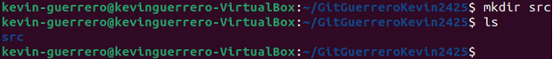
- Crea un archivo `README.md` en `GitApellido1Nombre2425` con una breve descripción del proyecto, usa constantemente el terminal.
  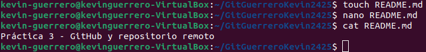

### 2. Inicializa Git:
- Entra en el directorio y conviértelo en un repositorio Git.
  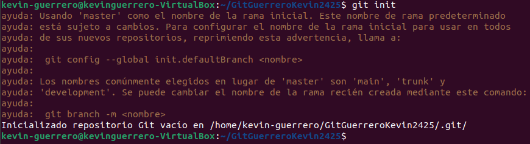
- Agrega un archivo `.gitignore` y configúralo para ignorar archivos de log y carpetas de configuración temporales.
  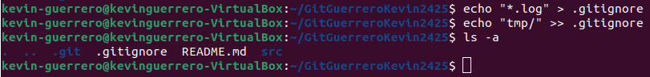

#### ¿Qué es el archivo `.gitignore` y para qué sirve?
Es un archivo de texto donde se especifican archivos y directorios que no deben ser rastreados por Git. Esto es útil para evitar subir archivos temporales, sensibles o irrelevantes al repositorio.

- Crea una estructura básica de web: `index.html`, `style.css`, `main.js`.
  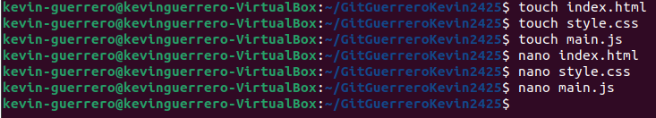
  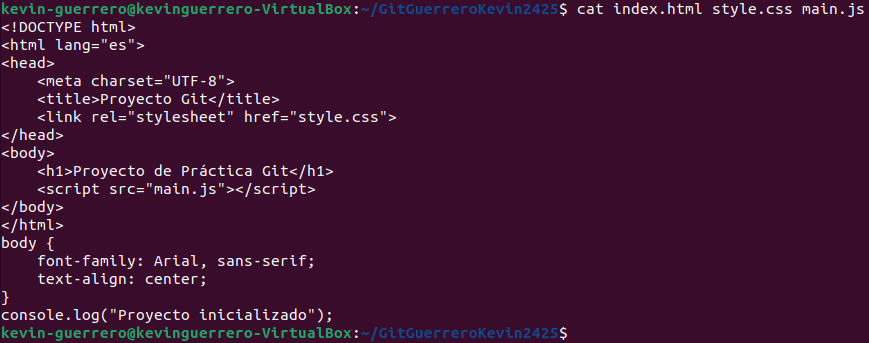

### 3. Primera confirmación:
- Haz un `git add` de todos los archivos y realiza un commit inicial con el mensaje:
  ```
  Inicio del proyecto con README.md y estructura básica.
  ```
  

---

## Parte 2: Colaboración en Equipo

### 1. Configura el repositorio remoto:
- Entra en GitHub y crea un repositorio.
  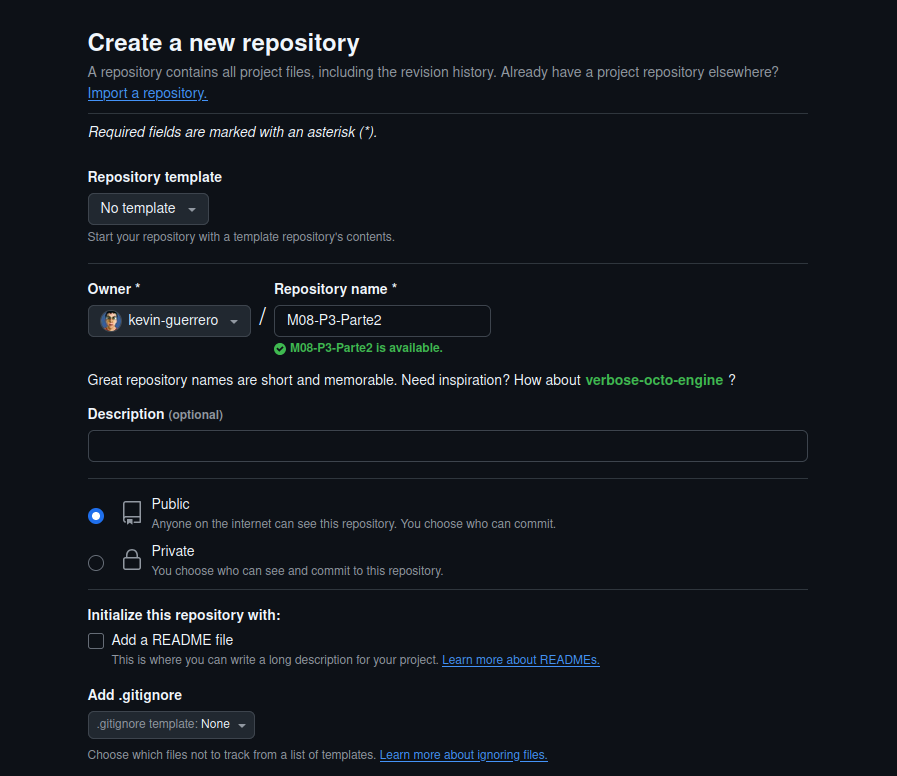
  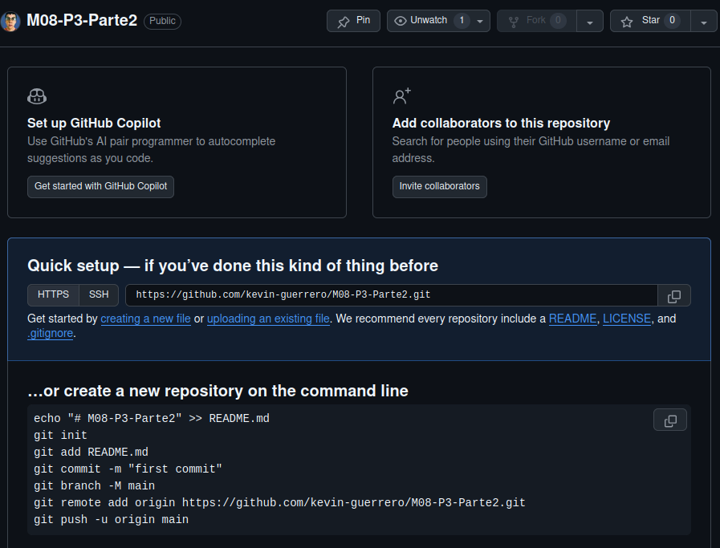

#### ¿Qué pasa si creo un repositorio con el archivo `README.md` desde GitHub?
- Se genera automáticamente un commit inicial.
- El repositorio ya tiene un archivo `README.md`.
- Al clonar, ya tendrás ese commit inicial.

#### ¿Qué pasa si creo un repositorio sin el archivo `README.md` desde GitHub?
- No hay commits iniciales.
- Tienes que hacer el primer commit manualmente.
- El repositorio está completamente vacío.

#### Diferencias entre las dos opciones anteriores:
Si creas un repositorio con un archivo `README.md` desde GitHub, al clonar el repositorio al local, puede haber problemas si ya tienes un archivo `README.md` local. Si creas un repositorio sin un archivo `README.md`, puedes vincularlo directamente sin problemas.

#### Comandos que te da GitHub al crear un repositorio:
```bash
echo "# M08-P3-Parte2" >> README.md
git init
git add README.md
git commit -m "first commit"
git branch -M main
git remote add origin https://github.com/kevin-guerrero/M08-P3-Parte2.git
git push -u origin main
```

- Vincula el repositorio remoto con el repositorio local.
  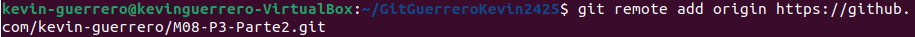
  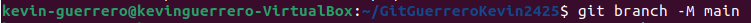
  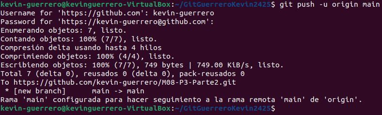
  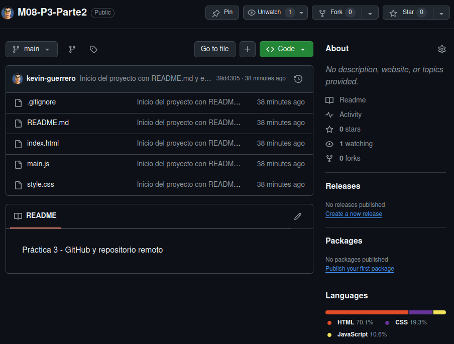
  
### 2. Actualización del Proyecto:
- Crea una nueva rama llamada `feature/documentacion` y cámbiate a ella.
  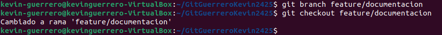
- Cambia a la nueva rama:
  - Crea un archivo `docs.md` en la carpeta raíz. Escribe un resumen de las funcionalidades del proyecto.
    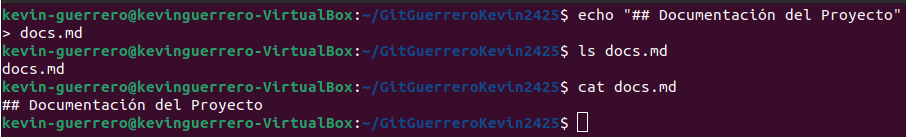
  - Haz un commit con el mensaje:
    ```
    Agregada documentación inicial del proyecto.
    ```
    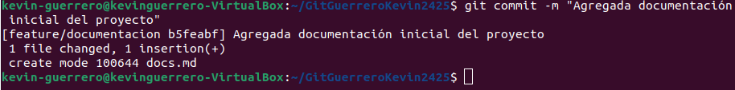
    
- Cambia a la rama `main` y usa `git diff` para comparar las diferencias entre `main` y `feature/documentacion`.
  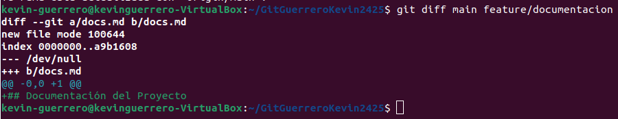
  
### 3. Sincronización:
- Desde la rama `main`, realiza un `git pull` para simular la descarga de cambios del remoto. Si hay conflictos, resuélvelos.
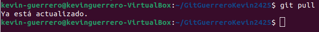
---

## Parte 3: Gestión de Archivos y Cambios

### 1. Ediciones rápidas:
- Crea un nuevo archivo llamado `src/app.py` con un mensaje básico (`print("Hola, mundo!")`).
  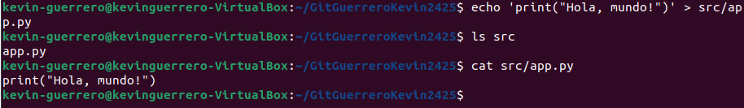
- Haz un `add` y luego un `commit`. Verifica su estado con `status` o con algún comando alias que hayas creado tú.
  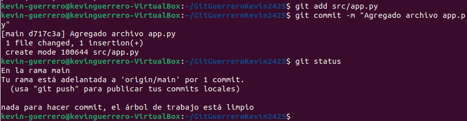
- Visualiza el historial de commits con `log` o con algún comando alias que hayas creado tú.
  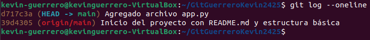

### 2. Borrado y recuperación:
- Borra el archivo `src/app.py` usando un comando de terminal. Recupera el archivo con el comando necesario.
  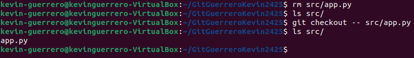

### 3. Combina ramas:
- Desde `main`, haz un merge de `feature/documentacion`.
  
- Usa `log` o un alias para verificar los cambios realizados y el historial.
  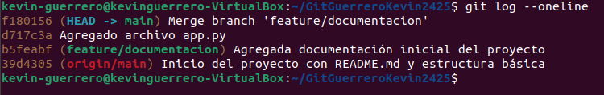
---

## Parte 4: Entrega del Proyecto

### 1. Últimos pasos:
- Asegúrate de que todos los archivos estén en su lugar y realiza un `push` final al remoto.
  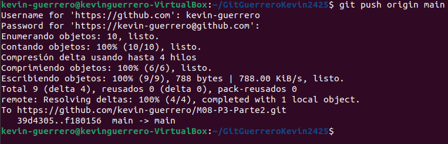
- Realiza una limpieza eliminando la rama `feature/documentacion`.
  

### 2. Explora el proyecto desde el terminal:
- Usa el comando necesario de Linux para listar el contenido de cada directorio.
  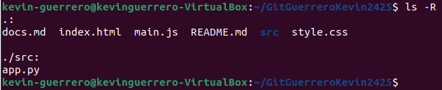
- Muestra el contenido de los archivos finales con el comando necesario de Linux.
  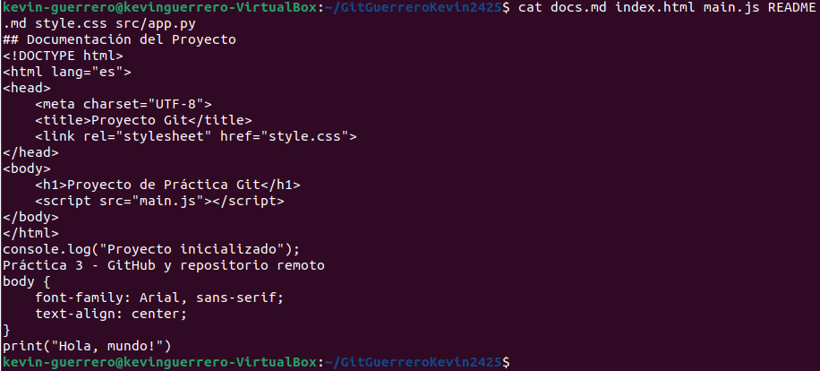
